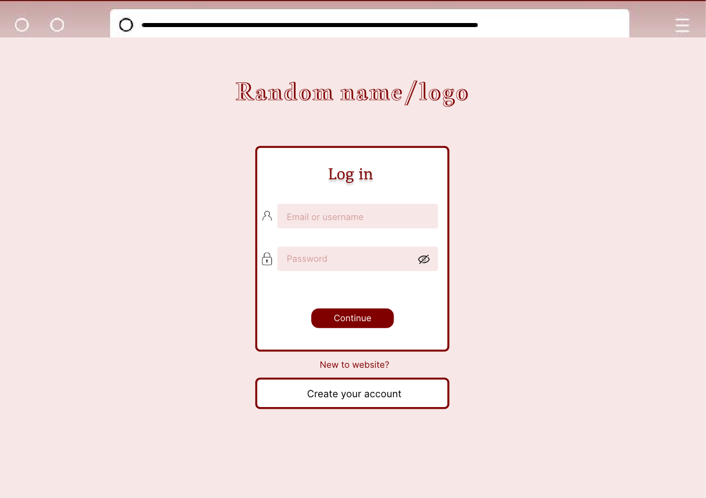
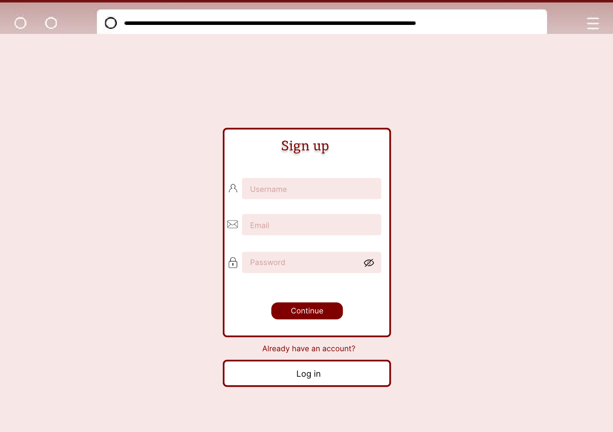
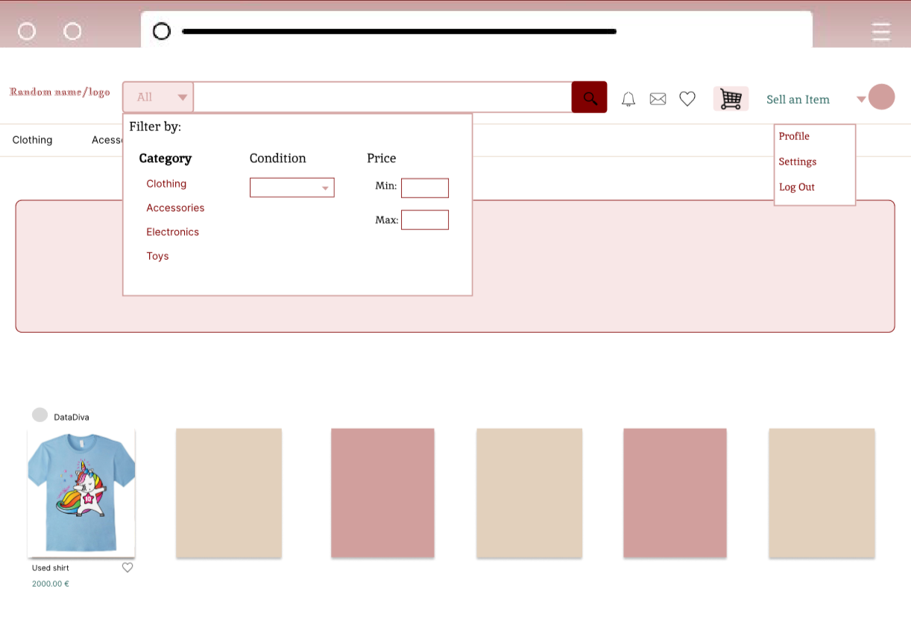
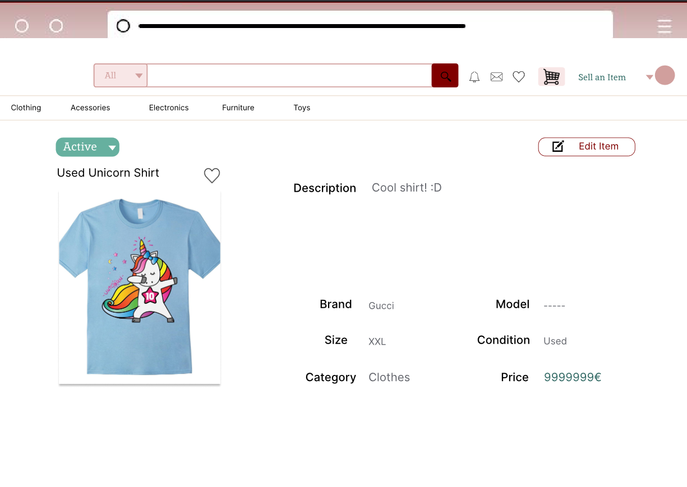
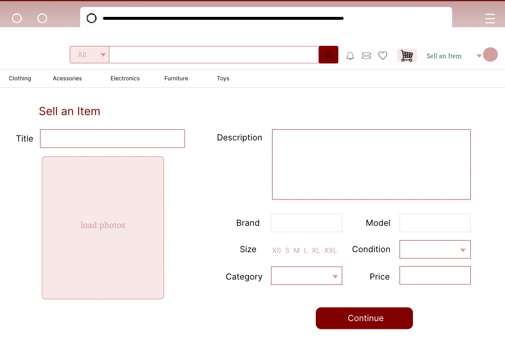
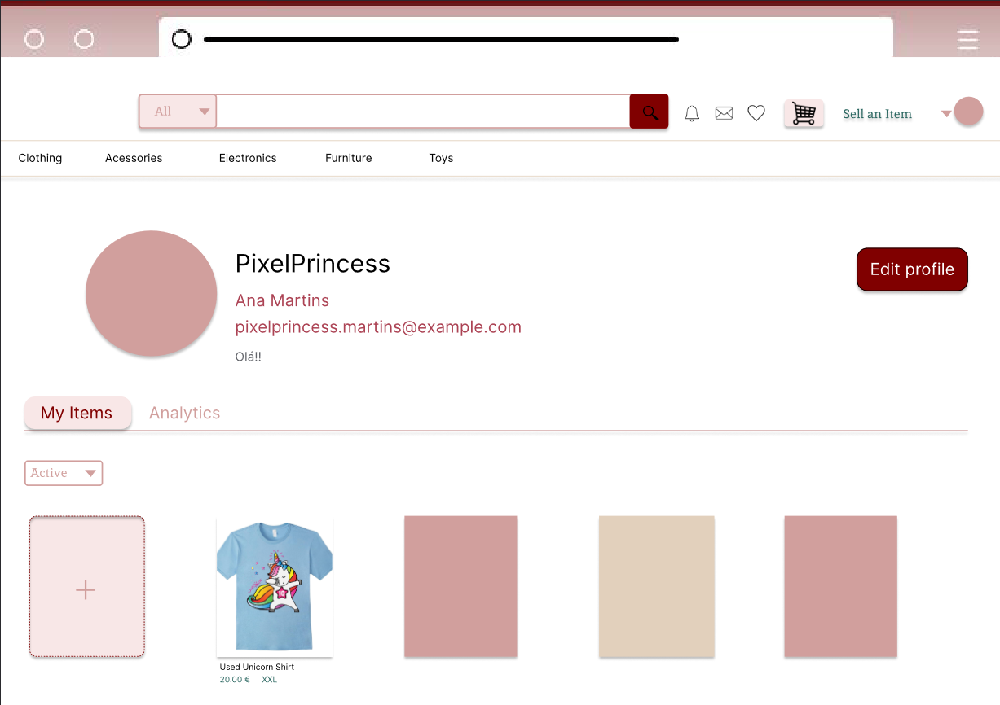
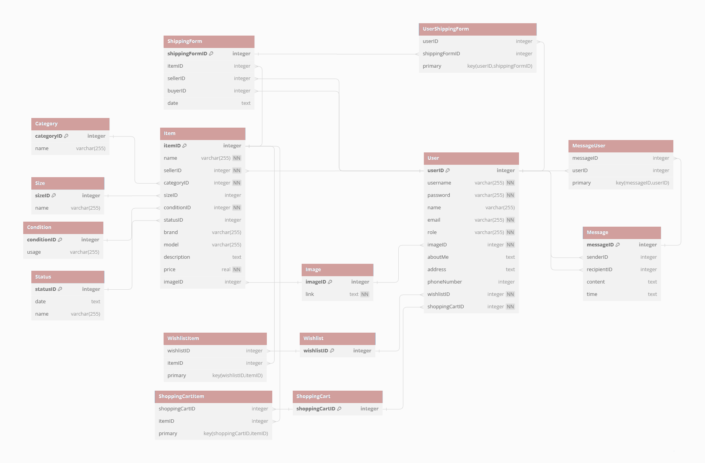

# LTW Project ltw04g06
## Objective
Develop a website that facilitates the buying and selling of pre-loved items

## Project done by:
  Alexandre Torres Costa up202207499
  Beatriz Alexandra de Almeida Bernardo up202206097
  Diana Magalhães Moreira Nunes up202208247

## Some credentials:
  (Username/Password)
  john_doe / john_doe1
  alice_wonderland / alice_wonder1

#MockUps

  

    
    
<b><i>Fig 1. Log in</i></b>

  

  

    
    
<b><i>Fig 2. Sign up</i></b>

  

  

    
    
<b><i>Fig 3. Main Page </i></b>

  

 
 

  

    
    
<b><i>Fig 4. View Item</i></b>

  

  

    
    
<b><i>Fig 5. Sell Item</i></b>

  

    

    
    
<b><i>Fig 6. Profile </i></b>

  

##UML

  

  
  <b><i>Fig 7. UML </i></b>

